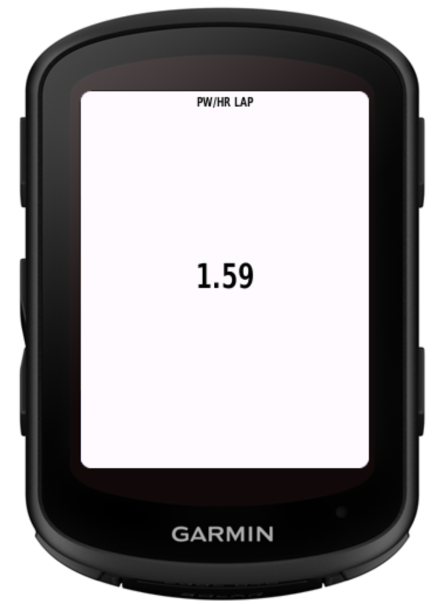
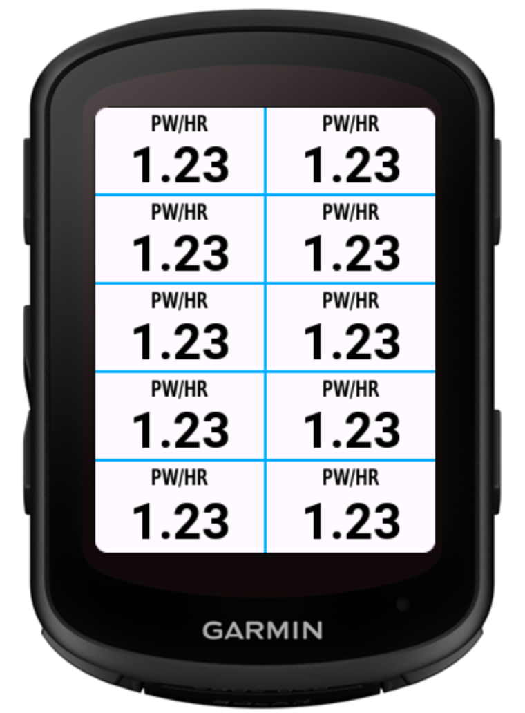
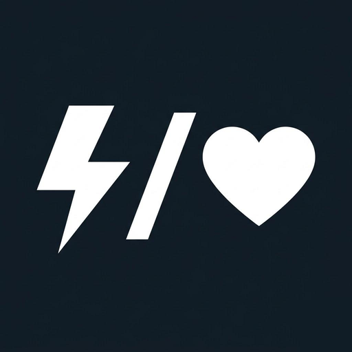

# Pw/Hr Data Field for Garmin Connect IQ

> A data field for Garmin Edge cycling computers that displays your **power-to-heart-rate ratio** — a simple metric to track your cycling efficiency in real time.

 

## Features

- **4 calculation modes**: Current, Workout Average, Lap Average, Rolling Average
- **Configurable rolling duration** (5–300s, default: 30s)
- **Two label styles**: Text (`PW/HR`) or Icon (`ϟ/♥`)
- **Localization**: English and German
- **Supported devices**: Edge 1050, Edge 840, Edge 540

## Labels

| Mode        | Text        | Icon      |
|-------------|-------------|-----------|
| Current     | PW/HR       | ϟ/♥       |
| Workout Avg | PW/HR Ø     | ϟ/♥ Ø     |
| Lap Avg     | PW/HR LAP   | ϟ/♥ LAP   |
| Rolling Avg | PW/HR 30s   | ϟ/♥ 30s   |

## Getting Started

### Prerequisites

- [Connect IQ SDK](https://developer.garmin.com/connect-iq/sdk/) (9.1.0+)
- Java 17 (e.g. `brew install openjdk@17`)
- [VS Code](https://code.visualstudio.com/) with the [Monkey C extension](https://marketplace.visualstudio.com/items?itemName=garmin.monkey-c)
- **Developer Key** (`developer_key.der`) — required for building and signing the app. This file is not checked into the repo. Store it safely (e.g. password manager or encrypted backup) — losing it means you cannot update the app on the Connect IQ Store.

### Build

```bash
monkeyc -f monkey.jungle -o bin/Pw2Hr.prg -d edge840 -y developer_key.der
```

### Run in Simulator

```bash
connectiq &
monkeydo bin/Pw2Hr.prg edge840
```

### Run Tests

```bash
monkeyc -f monkey.jungle -o bin/Pw2HrTest.prg -d edge840 -y developer_key.der -t
connectiq &
monkeydo bin/Pw2HrTest.prg edge840 -t
```

### Export for Store

```bash
monkeyc -f monkey.jungle -o bin/Pw2Hr.iq -e -y developer_key.der -r
```

### Install on Device

Connect your Garmin Edge via USB and copy the `.prg` file:

```bash
cp bin/Pw2Hr.prg /Volumes/GARMIN/GARMIN/APPS/
```

## Settings

Settings can be changed via **Garmin Connect Mobile** or on-device via the settings menu:

- **Calculation Mode** — Current, Workout Average, Lap Average, Rolling Average
- **Rolling Avg Duration** — 5–300 seconds (default: 30s)
- **Label Style** — Text (`PW/HR`) or Icon (`ϟ/♥`)

---

<p align="center">
  
  <br />
  &copy; 2026 Benjamin Macher
</p>

